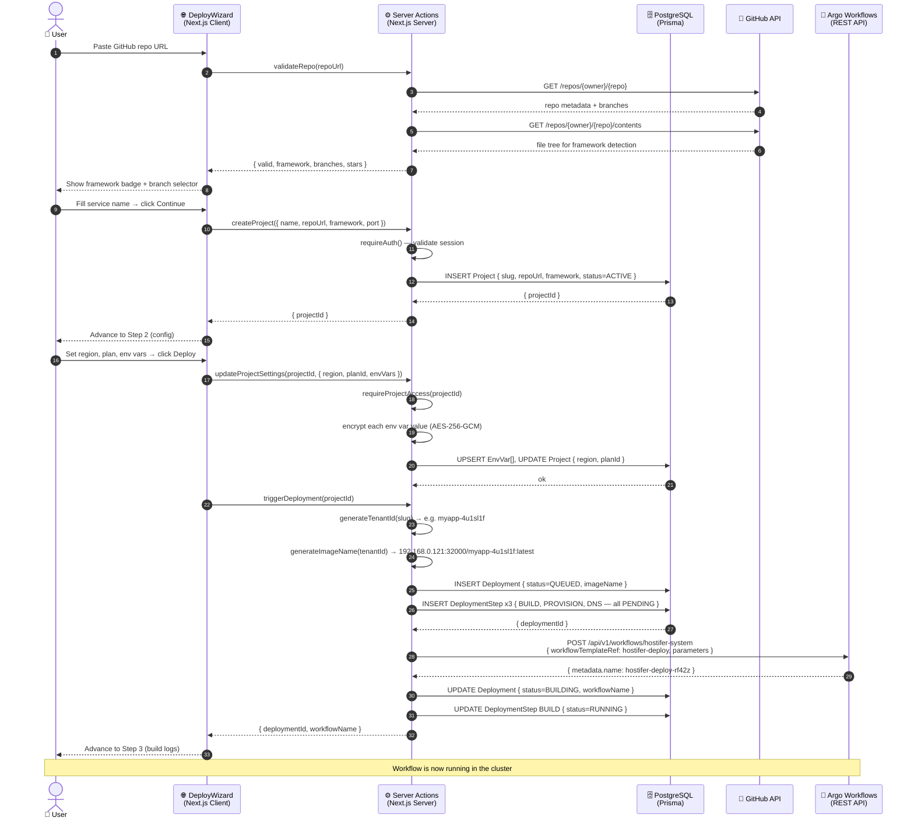
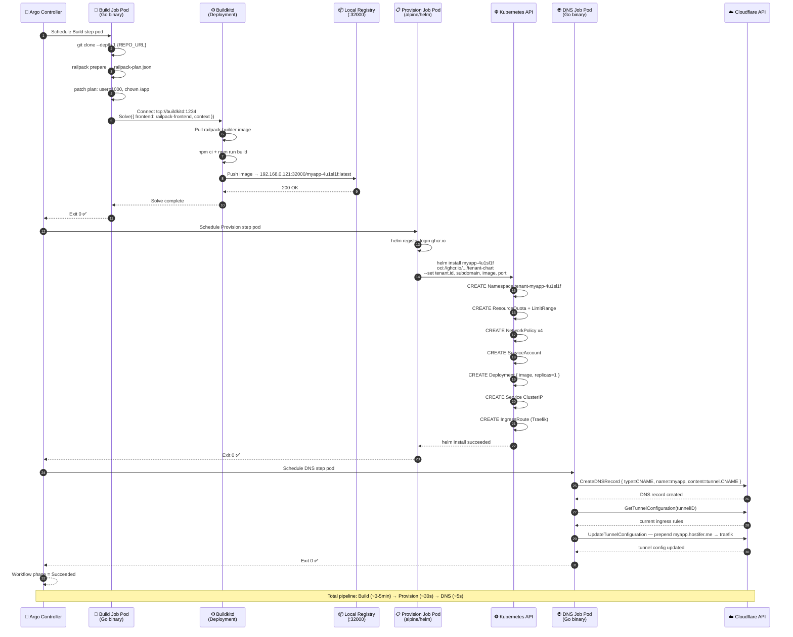
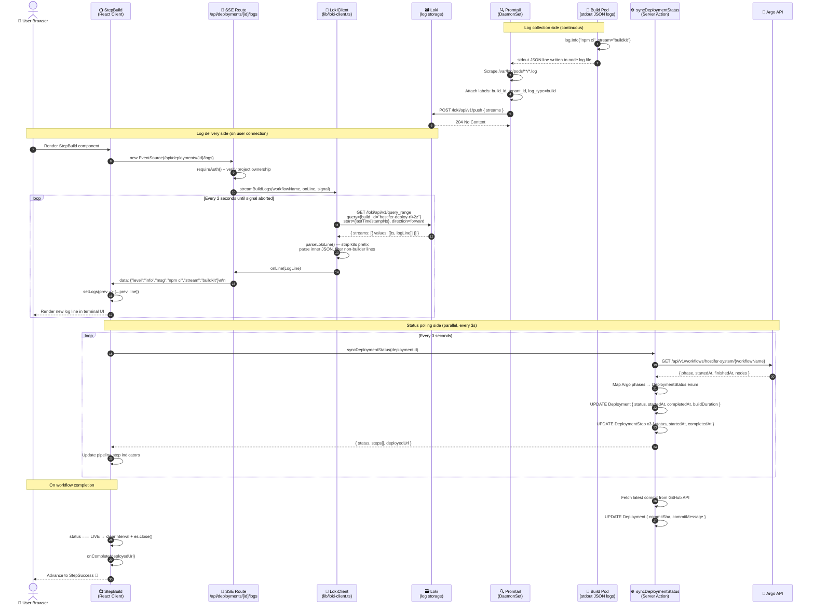
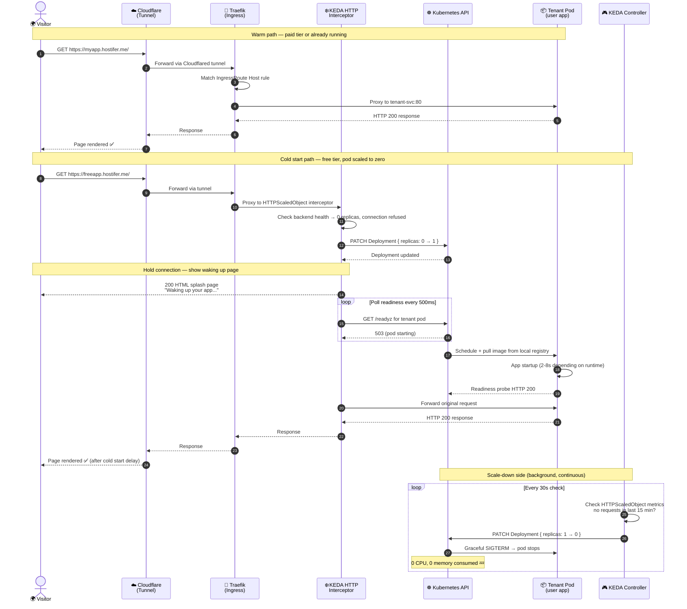

# Hostifer — System Sequence Diagrams

Four diagrams covering the full platform flow from authentication to
cold-start traffic handling.

---

## Diagram 1 — Deployment Trigger Flow

From the user submitting the deploy form to Argo Workflow being submitted
and the DB record being created.

---

## Diagram 2 — Argo Workflow Execution (Build → Provision → DNS)

What happens inside the cluster after the workflow is submitted.

---

## Diagram 3 — Real-Time Log Streaming Flow

How build logs travel from the Go builder pod to the user's browser.

---

## Diagram 4 — Tenant Traffic & Cold Start Flow (KEDA)

How incoming user traffic is handled for live tenants including cold start
for free tier (scaled-to-zero) deployments.

